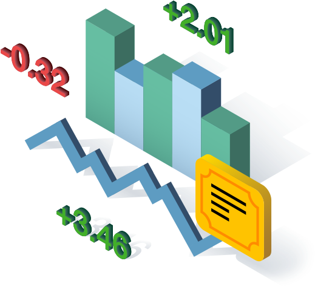

# StockList

[]()
[]()
[]()

<br />
<p align="center">
  <a href="https://github.com/ldelbel/react-capstone">
    
  </a>

  <h3 align="center">Catalogue of Stocks with Real-time information<h3>
  <p align="center">
    <a href="https://github.com/ldelbel/react-capstone"><strong>Explore the docs »</strong></a>
    <br />
    <br />
    -
    <a href="https://github.com/ldelbel/react-capstone/issues">Report Bug</a>
    -
    <a href="https://github.com/ldelbel/react-capstone/pulls">Request Feature</a>
    -
  </p>
</p>
  
  
    
## Table of Contents

<p align="center">
  <a href="#brief">Project Briefing</a> |
  <a href="#require">Technical Requirements</a> |
  <a href="#arch">Architecture, Data Management and Quality Control</a> |
  <a href="#ldl">Live Demo Link</a> |
  <a href="#ins">Installing</a> |
  <a href="#with">Built With</a> |
  <a href="#author">Author</a>
</p>

## Project Briefing <a name = "brief"></a>

This project is the React & Redux Capstone Project required for completing the React & Redux module at [Microverse](https://www.microverse.org/).

The capstone project is performed under time restrictions and presents business-like specifications to be followed. The goal is to simulate as much as possible the real conditions of business situations and practice professional execution.  

## Technical Requirements <a name = "require"></a>

The original specification and design for the project followed those of [Denys Chagaida's 'Pimp My Dog Online Store'](https://www.notion.so/Catalogue-of-Dog-Clothes-8bf1512b8ab34fa28848beb8ab698a32), however it is not required to follow the design and we are supposed to change the theme of the project. I chose to make a catalogue of stocks so I could have a grasp on the subject of finance, in which I'm interested.

The provided requirements stated that we must build the page with at least two types of pages:

- One page where all the displayed items could be filtered via given parameters
- A second page for the item details

Additionally, our app must collect data externally using asynchronous API calls.

## Architecture, Data Management and Quality Control <a name = "arch"></a>

### File Structure

The structure used in this project was the [Flat Structure](https://www.pluralsight.com/guides/how-to-organize-your-react-+-redux-codebase), because it fullfill the needs of the project based on it's size and complexity.

### State Management

The state of the entire app was managed using Redux Store.

### External Requests and API

The website is populated with data coming from the [Financial Modeling Prep API](https://financialmodelingprep.com/developer). Fetch() was used to make the requests, since the response data for this API is simple to handle and doesn't demand sophisticated processing.

### Quality Control

This project was built following the rules of [ESLint](https://eslint.org/) and [Stylelint](https://stylelint.io/).


## Live Demo Link <a name = "ldl"></a>

[Live Demo]()

## 🔧 Built with <a name = "with"></a>

- Javascript
- ReactJS
- Redux
- yarn
- Styled Components
- Financial Modeling Prep API

## 🛠 Requirements <a name = "req"></a>

You'll need a package manager to install the dependencies listed in package.json in order to make it work in your local machine.
This project used YARN. The installation guide can be found [Here](https://classic.yarnpkg.com/en/docs/install/#debian-stable).

## 🔨 Setup and Installing <a name = "ins"></a>

To setup the project, run the following commands on terminal:

```
$ cd <folder> (the place you want to have the files installed)
$ git clone https://github.com/ldelbel/react-capstone.git
$ cd react-capstone
$ yarn install

```

This will install the dependencies in your local machine. This process can take a few minutes.

## 🔨 Running Locally

After installing the dependencies you can start the application running the code below

```
$ yarn start

```

If your default browser doesn't open automatically, visit http://localhost/3000.

## ✒️ Author <a name = "author"></a>

### 👨‍💻 Lucas Delbel

[](https://github.com/ldelbel)
[](https://www.linkedin.com/in/lucasdelbel/)
[](mailto:lucdelbel@gmail.com)
[](https://twitter.com/delbel_lucas)

## 🤝 Contributing

Contributions, issues and feature requests are welcome!

Feel free to check the [issues page]().

## 👍 Show your support

Give a ⭐️ if you like this project!

## :clap: Acknowledgements

- Microverse: [@microverse](https://www.microverse.org/)
- React: [@react](https://reactjs.org/)
- Financial Modeling Prep API: [@financialmodelingprep](https://financialmodelingprep.com/developer/)
- Denys Chagaida's 'Pimp My Dog Online Store': [@pimp-my-DOG](https://www.behance.net/gallery/24531031/Pimp-my-DOG-Online-store-E-commerse-project)
